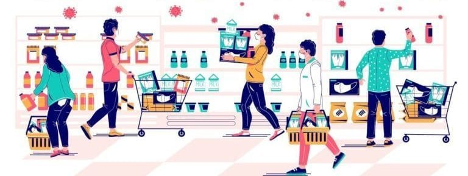

# Analysing consumer purchasing behavior using Primary research methodology



### Title - Customer Purchasing Behavior Survey

### Subtitle: Insights for Strategic Recommendations

Name - Ajay Landge

Date - 

## Agenda

 - Objective
 - Research Methodology
 - Demographic Information
 - Shopping Preferences
 - Purchasing Behavior
 - Post-Purchase Behavior
 - Key Findings & Insights
 - Conclusion & Recommendations

## Objective

- To understand customer purchasing behavior and preferences.
- To analyze key factors influencing purchasing decisions.
- To identify trends in spending, decision-making, and post-purchase behavior.

## Research Methodology
 - Data Collection: Primary research (Survey method)
 - Sample Size: [Specify if known]
 - Survey Type: Multiple choice and open-ended questions

## Demographic Information
```MR
1.	What is your age group?
o	18-24
o	25-34
o	35-44
o	45-54
o	55+
```
```MR
2.	What is your gender?
o	Male
o	Female
o	Other
o	Prefer not to say
```
```MR
3.	What is your average monthly income?
o	Less than ₹20,000
o	₹20,000 - ₹50,000
o	₹50,000 - ₹1,00,000
o	₹1,00,000+
```
```MR
4.	Where do you usually shop? (Select multiple)
o	Online Stores (Amazon, Flipkart, Myntra, etc.)
o	Retail Stores
o	Wholesale Stores
```
## Shopping Preferences
```MR
5.	How often do you shop for products?
o	Daily
o	Weekly
o	Monthly
o	Occasionally
```
```MR
6.	What product categories do you buy the most? (Select multiple)
o	Electronics
o	Furniture
o	Office Supplies
o	Home and Kitchen
o	Fashion and Apparel
o	Others: _______
```
```MR
7.	How do you decide what to purchase?
o	Online reviews
o	Price comparison
o	Brand reputation
o	Discounts/Offers
o	Recommendations from friends/family
```
## Purchasing Behavior
```MR
8.	What is your average spend per order?
o	Less than ₹500
o	₹500 - ₹1,000
o	₹1,000 - ₹5,000
o	₹5,000+
```
```MR
9.	Which factor influences your purchase the most?
o	Price
o	Product quality
o	Brand loyalty
o	Offers/Discounts
o	Availability
```
```MR
10.	Which payment method do you prefer?
o	Credit/Debit Card
o	UPI (Google Pay, PhonePe, Paytm)
o	Cash on Delivery
o	Net Banking
```
```MR
11.	Do you usually buy during sales and promotional periods?
o	Yes
o	No
```
```MR
12.	Have you ever abandoned your cart before checkout? If yes, why? (Select multiple)
o	High shipping cost
o	Better deal elsewhere
o	Changed mind
o	Payment issue
```
## Post-Purchase Behavior*
```MR
13.	How satisfied are you with your last purchase?
o	⭐⭐⭐⭐⭐ (Very Satisfied)
o	⭐⭐⭐⭐ (Satisfied)
o	⭐⭐⭐ (Neutral)
o	⭐⭐ (Dissatisfied)
o	⭐ (Very Dissatisfied)
```
```MR
14.	How often do you return products?
o	Never
o	Rarely (1-2 times a year)
o	Sometimes (3-5 times a year)
o	Often (6+ times a year)
```
```MR
15.	Do you leave product reviews after purchase?
o	Always
o	Sometimes
o	Rarely
o	Never
```
```MR
16.	Would you recommend this store to others?
o	Yes
o	No
```
```MR
17.	Any suggestions for improvement?
o	________________________________________
```

## Key Findings & Insights

Basis on survey data we can write finding and insights. It may include,
- Summary of Trends Observed
- Most Common Purchasing Motivations
- Key Pain Points (Cart Abandonment, Payment Issues, etc.)
- Recommendations for Business Strategy

## Conclusion & Recommendations
When writing Conclusion & Recommendations we will have to ensure below points - 
 - How This Data Will Be Used for Strategic Planning
 - Next Steps for Further Research and Implementation
 - Final Takeaways for Businesses
